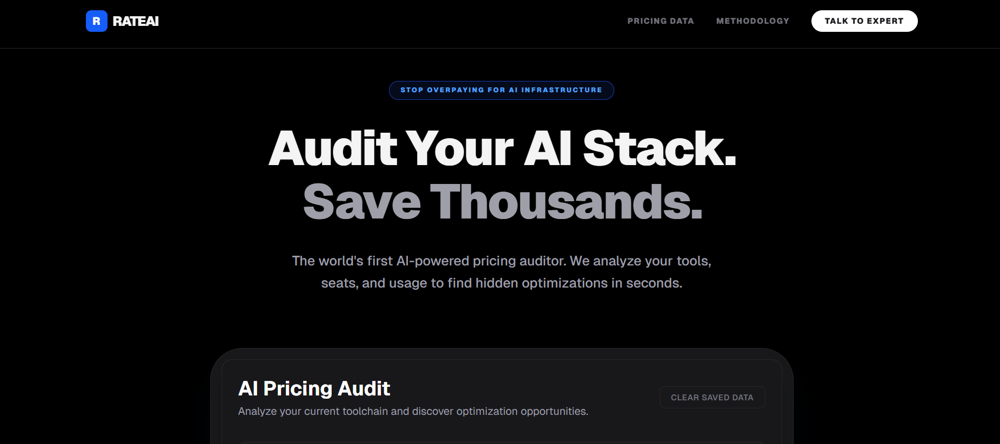
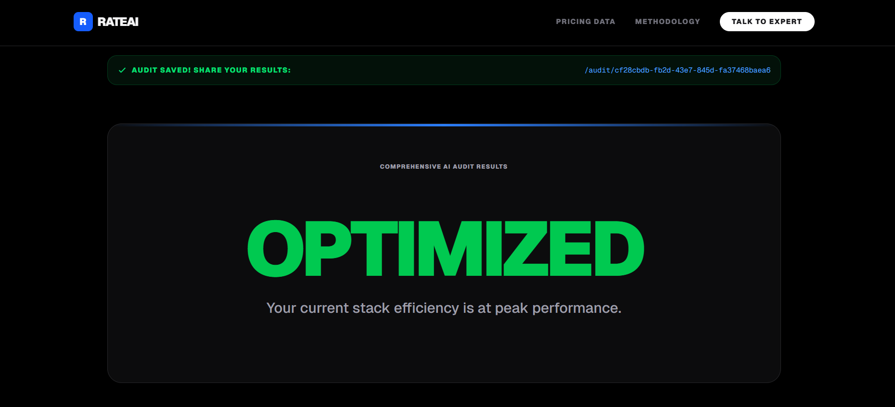
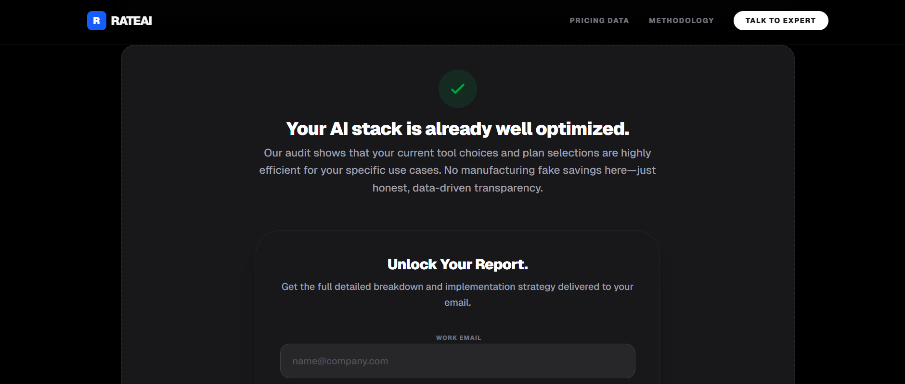

# RateAI

# RateAI is an AI-powered pricing intelligence platform designed for startups, SaaS businesses, and ecommerce founders. The platform helps users analyze competitor pricing, generate AI-driven pricing insights, and capture qualified leads through an interactive dashboard and automated workflows. It was built to simplify pricing strategy decisions using real-time analytics and AI assistance.

## Screenshots / Demo

### Landing Page


### AI Analysis Results



### AI Analysis Reprt via email 


## Live Deployment
https://rateai-yuvakishorekoppulas-projects.vercel.app?_vercel_share=cnCRq5PaO3liToXQkCgWYE4Wipcz5p6R

## Quick Start

### Clone Repository

```bash
git clone https://github.com/yuvakishorekoppula/rateai.git
cd rateai
```

### Install Dependencies

```bash
npm install
```

### Configure Environment Variables

Create a `.env.local` file:

```env
OPENAI_API_KEY=your_key
ANTHROPIC_API_KEY=your_key

NEXT_PUBLIC_SUPABASE_URL=your_url
NEXT_PUBLIC_SUPABASE_ANON_KEY=your_anon_key
SUPABASE_SERVICE_ROLE_KEY=your_service_key

RESEND_API_KEY=your_resend_key
```

### Run Locally

```bash
npm run dev
```

Open:

```text
http://localhost:3000
```

### Production Build

```bash
npm run build
```

### Deploy to Vercel

```bash
vercel
```
## Tech Stack

- Next.js 15
- TypeScript
- TailwindCSS
- Supabase
- OpenAI API
- Anthropic API
- Resend
- Vercel

---

## Key Features

- AI-powered pricing recommendations
- Competitor pricing analysis
- Lead capture and email workflows
- Responsive modern UI
- Real-time analytics dashboard
- Cloud deployment with Vercel

---

## Decisions & Trade-Offs

### 1. Next.js App Router instead of Pages Router
Used the App Router for better scalability and server-side rendering support, even though it added extra development complexity.

### 2. Supabase instead of Firebase
Selected Supabase because PostgreSQL provided stronger relational database support for analytics workflows.

### 3. Vercel for Deployment
Chose Vercel for seamless Next.js integration and automatic deployments, sacrificing some low-level infrastructure customization.

### 4. AI-First Architecture
Integrated OpenAI and Anthropic APIs early to prioritize intelligent pricing insights, despite higher API dependency costs.

### 5. Fast MVP Development
Focused on shipping a functional MVP quickly rather than implementing enterprise-level authentication and microservices initially.

---

## Future Improvements

- User authentication and profiles
- Saved pricing reports
- Automated competitor monitoring
- Stripe billing integration
- Advanced analytics and charts

---

## Author

Developed by Koppula Yuva Kishore.